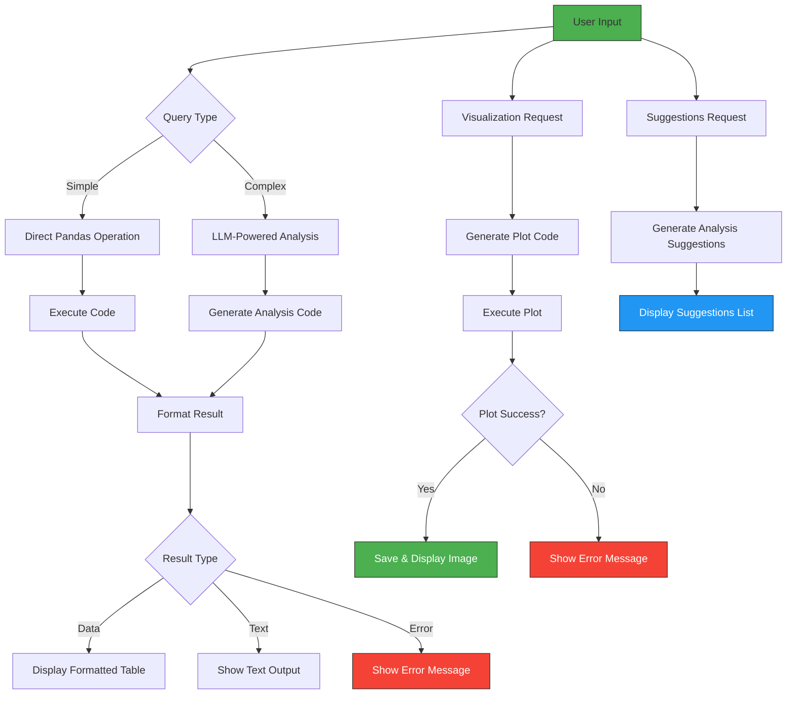

---
# Data Analysis Agent

A professional modular data analysis agent that leverages LLMs (Large Language Models) to perform complex data analysis tasks through natural language queries.

---

## Features

- **Natural Language Interface**: Ask questions about your dataset in plain English
- **Smart Analysis**: Automatically classify and execute simple/complex queries
- **Visualizations**: Generate charts and plots with AI-generated code
- **Suggestions**: Get intelligent suggestions for potential analyses
- **Modular Architecture**: Clean separation of concerns with dedicated modules

---

## Project Structure

```
data_analysis_agent/
├── main.py                 # Entry point - clean and simple
├── config/
│   ├── __init__.py
│   └── settings.py         # All configuration in one place
├── core/
│   ├── __init__.py
│   ├── state.py            # Global state management
│   ├── llm.py              # LLM initialization
│   ├── data_loader.py      # Dataset loading utilities
│   └── executor.py         # Code execution engine
├── tools/
│   ├── __init__.py
│   ├── analysis_tool.py    # Smart analysis tool
│   ├── visualization_tool.py # Visualization tool
│   └── suggestion_tool.py  # Suggestion tool
├── utils/
│   ├── __init__.py
│   ├── formatters.py       # Result formatting utilities
│   ├── code_generators.py  # Code generation utilities
│   └── file_handlers.py    # File handling utilities
└── agents/
    ├── __init__.py
    └── agent_manager.py    # Agent initialization and management
```

---

## Workflow

The Data Analysis Agent follows a well-defined workflow to process user queries and provide insightful results. Here's a visual representation of the workflow:



### Step-by-Step Workflow Description:

1. **User Input**
   - User enters a natural language query or command
   - Special commands: "exit", "suggestions"

2. **Query Classification**
   - The system classifies the query as:
     - Simple: Basic display operations (head, tail, shape)
     - Complex: Insights requiring analysis (grouping, correlations)

3. **Code Generation & Execution**
   - For simple queries: Uses fallback code if LLM is unavailable
   - For complex queries: Generates pandas code using LLM
   - Executes the generated code safely

4. **Result Formatting**
   - Truncates large outputs for readability
   - Formats DataFrames and Series for clean display

5. **Output Generation**
   - Returns formatted results to the user
   - Includes additional insights for complex queries

6. **Visualization Handling**
   - Separate visualization code generation
   - Safe execution and saving of plots
   - Automatic opening of generated images

7. **Suggestion Engine**
   - Analyzes dataset schema
   - Generates actionable analysis suggestions

---

##  Installation

1. Clone the repository
2. Install dependencies:
```bash
pip install -r requirements.txt
```
3. Set up environment variables:
```bash
cp .env.example .env
```
4. Add your Groq API key to `.env`:
```
GROQ_API_KEY=your_api_key_here
```

---

##  Usage

Run the application:
```bash
python main.py
```

When prompted:
1. Enter the path to your dataset (CSV or JSON)
2. Ask questions in natural language, e.g.:
   - "Show me the first 5 rows"
   - "What's the average value of column X?"
   - "Create a histogram of sales data"
   - "Suggest interesting analyses"

Type "exit" or "quit" to end the session.

---

## Example Queries

### Simple Display
- Show the first 5 rows
- What are the column names?
- How many rows are there?

### Data Analysis
- What's the average salary?
- Which product has the highest sales?
- Show me the correlation between variables

### Visualizations
- Create a bar chart of department sizes
- Plot a histogram of salaries
- Show a scatter plot of revenue vs expenses

### Suggestions
- Type "suggestions" to get recommended analyses

---

##  Configuration

All configuration is managed through `config/settings.py` and `.env`:
- API keys (Groq)
- Display limits
- Output directories
- Default models

---

## Requirements

- Python 3.8+
- pandas
- numpy
- langchain_groq
- matplotlib
- seaborn
- python-dotenv
- IPython

---

## Tools Overview

| Tool Name             | Purpose                                         |
| --------------------- | ----------------------------------------------- |
| `smart_analysis_tool` | Generates and executes pandas analysis code     |
| `visualization_tool`  | Generates and executes matplotlib/seaborn plots |
| `suggestion_tool`     | Suggests next analysis questions to explore     |

---

##  Notes

- The agent automatically detects file encoding when loading CSVs
- Results are formatted neatly with truncation for large outputs
- Visualizations are saved in an output directory
- Safe execution prevents dangerous operations in generated code

