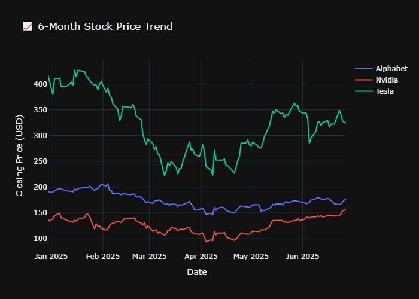

# 💸 AI Investment Advisor Agent

An intelligent, multi-agent system that assists users in making informed stock investment decisions using **LangChain**, **LLMs (Groq/OpenAI)**, **yFinance**, and **Plotly**.

<div align="center">
  
</div>

---

## Features

- Understands user queries like: _"Should I invest in Tesla or Google?"_
- Extracts valid company names using LLMs
- Converts company names to stock tickers (e.g., Google → GOOG)
- Fetches 6-month historical stock price data using `yfinance`
- Generates dynamic visual plots using `Plotly`
- Provides a full investment report with:
  - Company insights
  - Risk–reward assessment
  - Final investment recommendation
- Built with LangChain agents and tools

---

## Architecture

User Query ➝ Query Parser ➝ Ticker Lookup ➝ Data Fetching ➝
Company Research + Stock Analysis ➝ Investment Report ➝ Plot ➝ Final Output

---

## Tech Stack

| Tool/Library        | Role                                      |
|---------------------|-------------------------------------------|
| LangChain Agents    | Tool orchestration and LLM workflows      |
| Groq / OpenAI LLM   | Natural language understanding & reasoning|
| yfinance            | Historical stock price data               |
| Plotly & Kaleido    | Interactive and exportable charts         |
| dotenv              | API key and environment management        |

---

## Project Structure
```
AI_Investor_Agent/
├── main.py                      # Entry point for user queries
├── query_parser.py              # Extracts companies from query
├── tools/
│ └── ticker_lookup.py           # Converts company name → ticker
| └── company_info.py
| └── stock_data
├── agents/
│ ├── market_analyst.py
│ └── company_researcher.py
| └── stock_strategist.py
| └── team_lead.py
├── chain/
│ └── investment_report_chain.py
├── visualizations/
│ └── plot_generator.py          # Dynamic plot with Plotly
├── output/
│ └── stock_performance_plot.png
├── .env                         # Store your API keys here
└── requirements.txt             # All dependencies

```
---

## Installation

```bash
git clone https://github.com/UzmaKhatun/Decision Support Agent.git
cd Decision Support Agent
pip install -r requirements.txt
```

---

## Environment Setup
Create a .env file in the root directory and add your API key:
```
GROQ_API_KEY=your_groq_api_key
```

---

## Usage
```
python main.py
```

---

## Decision Support Logic
- Combines historical performance, sector fundamentals, and optional news
- Computes percentage change over 6 months
- Visual aid with stock trend plot
- Ranks and recommends best stock

---

## Author
Made with ❤️ by Uzma Khatun, an aspiring Data Scientist and AI/ML Enthusiast.
